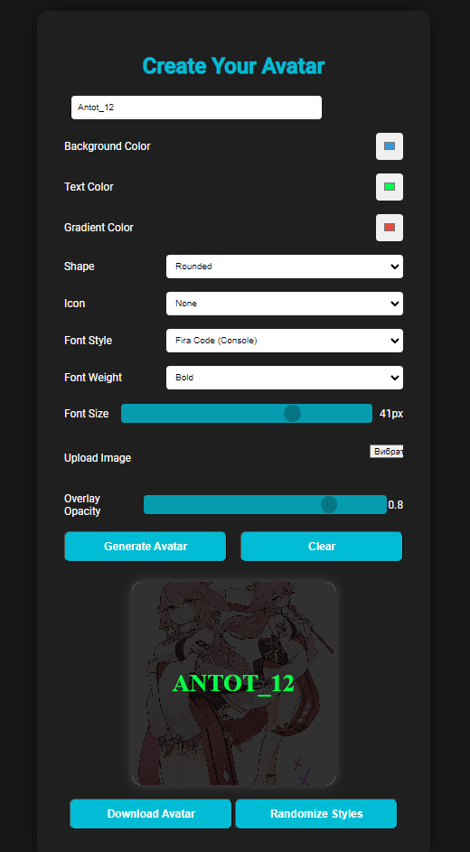
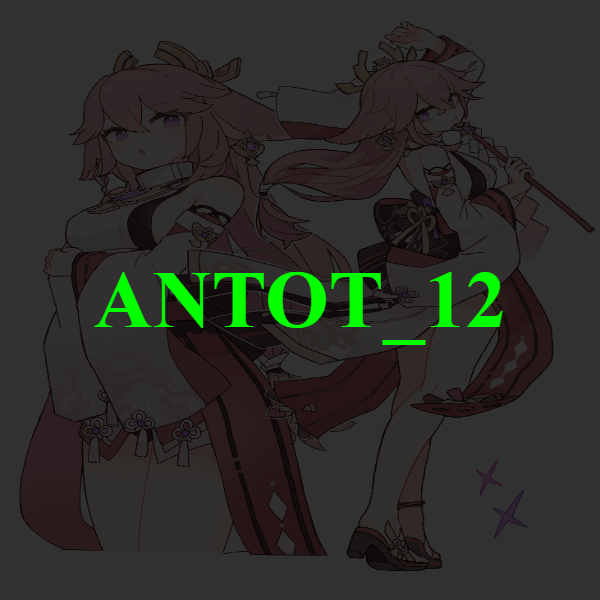

# 🌟 The Greatest Avatar Generator 🎨

Welcome to the **The Greatest Avatar Generator**! Create custom avatars with your own styles, text, colors, and icons. This web app allows you to download your avatar in **PNG** format with a **transparent background**.



## Features ✨

<hr>

- 🌈 **Customizable Backgrounds:** Choose between solid colors and gradients.
- 🖋 **Text Styling:** Adjust font, size, weight, and color for avatar text.
- 💾 **Image Upload:** Upload and overlay images with adjustable transparency.
- 🎨 **Icons**: Add icons like ⭐ stars, ❤️ hearts, ✔️ checks.
- 🔄 **Randomization:** Automatically randomize avatar styles with the click of a button.
- 📥 **Download as PNG:** Save your avatar as a PNG file with a transparent background.


## Installation 🛠️

<hr>

1. **Clone the repository**:
    ```bash
    git clone https://github.com/your-username/avatar-generator.git
    cd avatar-generator
    ```

2. **Install dependencies**:
    ```bash
    pip install -r requirements.txt
    ```

3. **Run the app**:
    ```bash
    python avatar_generator.py
    ```

4. Open your browser and navigate to `http://127.0.0.1:5000` to view the app.

## How to Use 💡

<hr>

1. **Enter Text**: Add a name or any text.
2. **Customize Style**: Choose background colors, font, icon, and shape.
3. **Upload an Image**: Add your own image with customizable transparency.
4. **Download**: Export the avatar as a **PNG** file.

## Usage 🚀

<hr>

Once the app is running locally, follow these steps to generate your avatar:

1. **Open the App** 🔗: After running the app, open [`http://127.0.0.1:5000`](http://127.0.0.1:5000) in your web browser.


2. **Customize Your Avatar** 🎨:
    - **📝 Text Input**: Enter your name or text in the input field.
    - **🌈 Background Color**: Pick a solid or gradient color for your avatar's background.
    - **🎨 Text Styling**: Customize the text color, choose from different fonts, adjust the weight (bold or regular), and change the size using the provided options.
    - **🔲 Shape**: Select whether you want a **circle**, **square**, or **rounded** avatar shape.
    - **⭐ Icon**: Choose from a selection of icons like stars, hearts, or checks to make your avatar stand out.
    - **🖼️ Image Upload**: Upload your own image to overlay on the avatar, with adjustable transparency.


3. **Preview Your Avatar** 👀: See a real-time preview of your avatar with all selected customizations in the preview box.


4. **Download Your Avatar** 💾: Once you're happy with the design, click the **Download Avatar** button to save it as a PNG file with a transparent background.


5. **Randomize Styles** 🔄: If you want some creative inspiration, hit the **Randomize** button to automatically generate a new set of styles for your avatar.


## Demo 🚀

<hr>



Enjoy creating personalized avatars! 🎨✨
